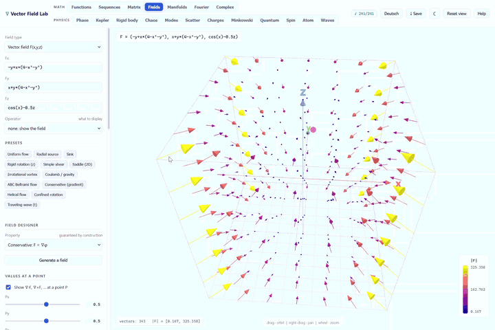
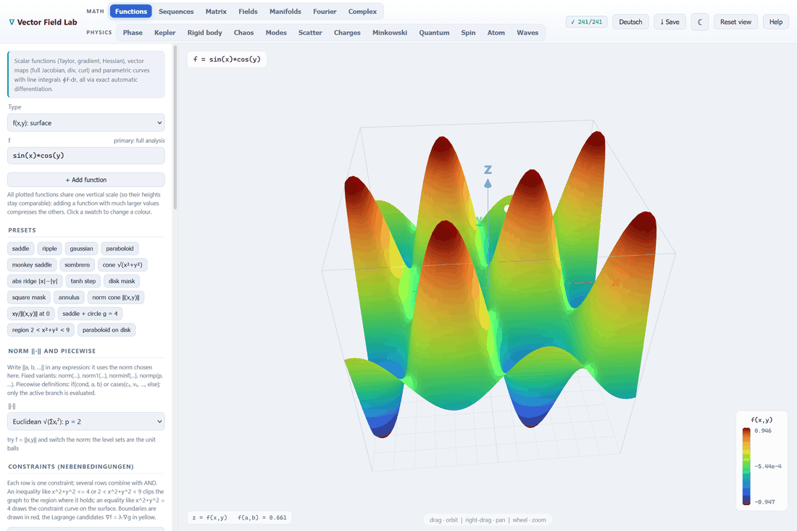
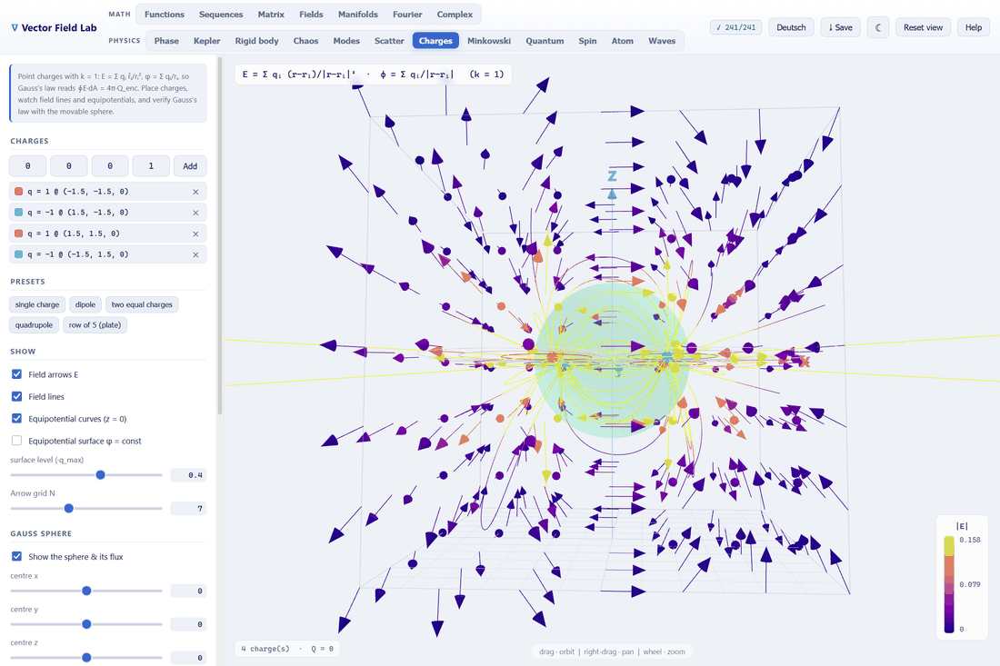
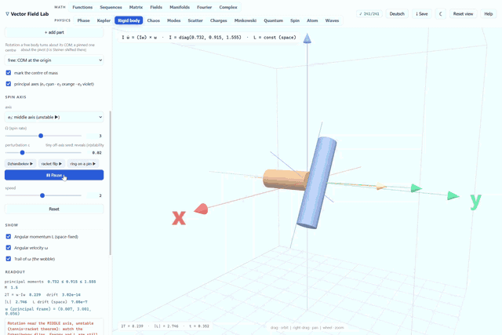
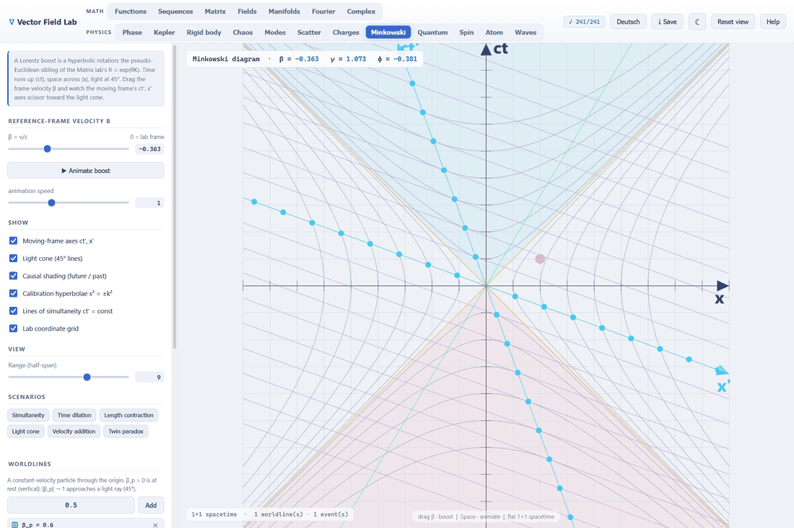
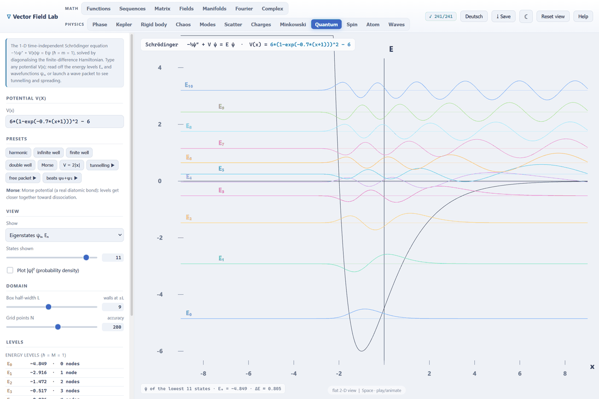

# ∇ Vector Field Lab

An interactive, browser-based playground for **vector calculus**, **linear maps** and the physics that
grows out of them. Type any field, watch its gradient, divergence, curl or Laplacian in 3D, trace
streamlines, drop test bodies into the flow and see how a matrix acts on space.

Everything runs locally with **no installation, no build step and no internet**. Three.js is vendored
and the math engine is self-contained.

<p align="center">
  <a href="https://lorenzrutkevich.github.io/vector-field-lab/">
    
  </a>
</p>

<p align="center">
  <b><a href="https://lorenzrutkevich.github.io/vector-field-lab/">▶ Open the live demo</a></b>
</p>

## Run it

Open the [live demo](https://lorenzrutkevich.github.io/vector-field-lab/) or grab the repo and
double-click `index.html` (or `start.bat` on Windows). It opens in your default browser and works
completely offline.

> If your browser is strict about local files, serve the folder instead: run `python -m http.server`
> here and open `http://localhost:8000`.

A badge in the top bar (`✓ 241/241`) shows the built-in self-tests passing on every load.

## Nineteen labs

The tab bar splits into **Math** (Functions, Sequences, Matrix, Fields, Manifolds, Fourier, Complex)
and **Physics** (Phase, Kepler, Rigid body, Chaos, Modes, Scatter, Charges, Minkowski, Quantum, Spin,
Atom, Waves).

### Math



- **Functions**: scalar `f(x)`, `f(x,y)`, `f(x,y,z)` and vector maps, with exact value, gradient,
  Jacobian, Hessian and Taylor polynomial from automatic differentiation. Drag the expansion point and
  watch the Taylor approximation peel away. Constraints clip the graph or trace a curve on it, with the
  **Lagrange candidates** ∇f = λ∇g marked. Dedicated sections analyse **continuity** (Lipschitz ⊂
  uniformly continuous ⊂ continuous, each verdict with its reason) and the **total derivative**
  (tangent plane, remainder test, directional probe).
- **Fields**: enter `F = (Fx, Fy, Fz)` or a scalar `f` and display ∇f, ∇·F, ∇×F, ∇² or |F|. Overlay
  streamlines, compute line integrals ∮F·dr and drop bodies that either follow the flow
  (spinning with ω = ½∇×F) or obey Newton. The **field designer** generates random fields whose
  property holds as an identity, built from a potential rather than checked numerically.
- **Matrix**: a 3×3 matrix acting on space. Deformed unit cube, basis images, eigenvectors and the
  animated flow `x(t) = exp(tA)`, plus determinant, trace, rank, eigen-decomposition, inverse and `exp(A)`.
- **Manifolds**: parametric surfaces coloured by Gaussian curvature (fundamental forms, K, H, principal
  curvatures, Gauss-Bonnet), level sets as real isosurfaces with tangent planes and curves with the
  Frenet frame, curvature and torsion.
- **Sequences**, **Fourier**, **Complex**: the ε-N game and uniform vs pointwise convergence; Fourier
  series with the Gibbs overshoot and the transform with Δx·Δk; domain colouring with a numeric
  Cauchy-Riemann check.

### Physics



- **Charges**: point charges with k = 1. Field arrows, field lines, equipotentials and a movable
  **Gauss sphere** whose numerically integrated flux ∮E·dA is checked live against 4π·Q_enclosed.
- **Rigid body**: build a body from primitives, let the app assemble and diagonalise the inertia tensor,
  then spin it. Torque-free Euler equations, exact SO(3) orientation, conserved L and the
  **Dzhanibekov flip** on the unstable middle axis.



- **Minkowski**: a 1+1 spacetime diagram where a Lorentz boost is the hyperbolic rotation `Λ = exp(φK)`,
  the same exp-of-a-generator as `R = exp(θK)` in the Matrix lab. Calibration hyperbolae, lines of
  simultaneity, causal shading, worldlines, events and scenarios from time dilation to the twin paradox.



- **Quantum**: the 1-D time-independent Schrödinger equation for any potential `V(x)`, solved by
  diagonalising the finite-difference Hamiltonian. Energy levels and wavefunctions, exact wave-packet
  evolution in the eigenbasis (spreading, bouncing, tunnelling) and superposition beats.



- **Kepler**, **Phase**, **Chaos**: central-force orbits with the Laplace-Runge-Lenz vector and
  perihelion precession as soon as p ≠ 2; the phase plane with direction field, classified fixed points
  and energy contours; the double pendulum with a Poincaré section that dissolves into dust.
- **Modes**, **Waves**, **Scatter**: normal modes from the generalized eigenvalue problem
  (K − ω²M)φ = 0, including chain dispersion and band gaps; wave, heat and free Schrödinger evolution of
  the *same* initial bump, exact in time via sine modes; classical scattering with the exact deflection
  integral and dσ/dΩ from the b → θ Jacobian.
- **Spin**, **Atom**: a qubit precessing on the Bloch sphere with projective measurement and the real
  hydrogen orbitals as a probability cloud or signed |ψ|² isosurface.

## Expression syntax

- **Variables** `x`, `y`, `z` and time `t`. **Shortcuts** `r`, `rho`, `phi`, `theta`, `r2`.
  **Constants** `pi`, `tau`, `e`. Power is `^`, products may be implicit (`2x`, `3sin(x)`, `xy` = `x·y`).
- **Absolute value** with bars: `|x-y|`. **Norms** with `||a, b, …||`, switchable between Euclidean,
  1-norm, max-norm and general p-norm.
- **Comparisons** `<` `<=` `>` `>=` `==` `!=` return 1 or 0, so `x^2+y^2 < 1` plots a disk and
  `1 < x^2+y^2 < 4` an annulus. **Piecewise** via `if(cond, a, b)` and `cases(…)`, which evaluate only
  the active branch, so `if(||x,y|| != 0, x*y/||x,y||, 0)` is exactly 0 at the origin.
- **Functions**: `sin cos tan asin acos atan atan2 sinh cosh tanh exp ln log10 log2 sqrt cbrt abs sign
  floor ceil round min max mod clamp step smoothstep hypot gauss sinc`.
- Every number box (sliders, matrix cells, ranges) also accepts constant expressions like `pi/4` or `sqrt(2)`.

Examples: `-y/rho^2` · `x/r^3` · `exp(-(x^2+y^2+z^2))` · `sin(x - t)`.

## Controls and interface

Left-drag **orbit** · right-drag or Shift+drag **pan** · wheel **zoom** · **Space** play/pause ·
**R** reset view.

The sun/moon button switches dark and light and the language button switches the whole interface
between **English and German**, help manual included. Both choices are remembered. **`⤓ Save`**
downloads the current view as a high-resolution PNG captioned with the expression.

## How it's built

Plain ES5 JavaScript and [Three.js](https://threejs.org) (r128, vendored). No frameworks, no dependencies.

| Area | Files |
|---|---|
| Math core | `parser.js`, `autodiff.js`, `fieldmath.js`, `linalg.js`, `manifolds.js` |
| Physics | `quantum.js`, `minkowski.js`, `dynamics.js`, `waves.js`, `modes.js`, `scatter.js`, `bodies.js`, `rigid.js` |
| Rendering | `scene.js`, `controls.js`, `colormaps.js` |
| Interface | `ui/kit.js` (helpers, state, registry), `ui/core.js` (orchestration), `ui/<lab>.js` (one per lab) |
| Content | `presets.js`, `design.js`, `i18n.js`, `tests.js` |

Every lab lives in one file under `src/ui/` and registers itself as it loads:

```js
K.lab({
  key: 'kepler', label: 'Kepler', flat: true,
  panel: buildKeplerPanel,   // build the side panel
  enter: function () { … },  // called when the tab is selected
  frame: function () { … },  // one animation step (only the active lab's runs)
  togglePlay: toggleKeplerPlay
});
```

`ui/core.js` drives all of them through that single table, so tab switching, the animation frame, panel
building and the Space key are each one loop instead of a nineteen-way branch. Adding a lab means adding
a file and a `<script>` tag and nothing in `core.js` changes.

The math core is covered by in-app self-tests spanning the parser, linear algebra, field operators,
automatic differentiation, line integrals, manifold geometry, Lorentz boosts, the Schrödinger
eigensolver, RK4 dynamics, Fourier analysis, every field-designer property, exact PDE mode evolution and
scattering against closed forms. They run on every load and report to the badge in the top bar.

## License

[Vector Field Lab License 1.0](LICENSE), the PolyForm Noncommercial License 1.0.0 plus Share Alike and
Grant Back terms. Copyright 2026 [Lorenz Rutkevich](https://github.com/LorenzRutkevich).

In short: free for students, teachers, universities, research and personal use. If you fork it and share
your fork, it stays under this same license with source included and the original author keeps the right
to use your improvements. Commercial use needs a separate license.

Three.js (`vendor/three.min.js`) is a separate work under the MIT License and keeps its own terms.
